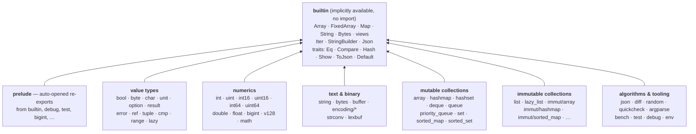

# moonbitlang/core

 

moonbitlang/core is the standard library of the [MoonBit language](https://www.moonbitlang.com/). It is released alongside the compiler. You can view the documentation for the latest official release at <https://mooncakes.io/docs/moonbitlang/core/>. This repository serves as the development repository.

## Architecture at a glance

Almost every package in this repository sits on top of `builtin`, which is
available in every MoonBit program without an import (`builtin` itself
bootstraps on the tiny `abort` package). `prelude` is opened automatically
and re-exports the commonly used names from `builtin` plus a few companions
(`Debug`, `BigInt`, `Ref`, `Lazy`, test assertions, …). Everything else is an
ordinary package imported as `moonbitlang/core/<pkg>` and used via `@<pkg>`:

## Current status

It is experimental and under active development. At this early stage, our primary focus is on enhancing the functionality of `moonbitlang/core`.

⚠️**The API is subject to change.**

### Timeline

The core is making large changes in the last few months, we are expected to reach beta-preview status in mid-August.

## Contributing

We are actively developing moonbitlang/core and appreciate your help!

To contribute, please read the contribution guidelines at [CONTRIBUTING.md](./CONTRIBUTING.md).

### Being a collaborator

Note we regularly evaluate external contributions and invite active contributors to join us as collaborators, thank you!
To keep the contributors manageable, we will revoke commit rights if external collaborators are not active for over 6 months.
