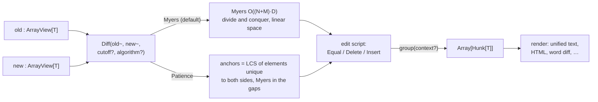

# Diff

Compute edit scripts between two sequences using the Myers diff algorithm by
default, or patience diff when you pass `algorithm=Patience`.

`Diff` works with any element type that implements `Hash + Eq`. Constructing a
`Diff[T]` bundles the source arrays with the edit script. Call `group` on the
result to split far-apart changes into separate `Hunk[T]` values for
unified-diff-style output.



The separate Levenshtein functions live outside this pipeline:
`edit_distance` / `edit_distance_within` answer only "how many edits" with a
two-row dynamic program (banded when you give `max_distance`), and
`levenshtein_edits` produces a run-length script that, unlike `Edit`, also
has a `Replace` operation for substitutions.

## Compute A Diff

`Diff(old~, new~)` computes the full sequence of `Delete`, `Insert`, and
`Equal` operations, accessible via `edits()`.

```mbt check
///|
test "Diff computes deletes inserts and equals" {
  let old = ["apple", "pear", "banana"][:]
  let new = ["apple", "banana", "coconut"][:]

  let d = @diff.Diff(old~, new~)

  assert_eq(d.edits().length(), 4)
  assert_true(
    d.edits()
    is [
      Equal(old_index=0, new_index=0, len=1),
      Delete(old_index=1, old_len=1, new_index=1),
      Equal(old_index=2, new_index=1, len=1),
      Insert(old_index=3, new_index=2, new_len=1),
    ],
  )
}
```

## Prefer Unique Anchors With Patience Diff

Pass `algorithm=Patience` to `Diff(old~, new~, algorithm=Patience)` to enable
patience diff. This first finds elements that appear exactly once in both
inputs and uses them as anchors, then runs Myers diff on the unmatched ranges
between those anchors. This can produce more stable result when repeated
elements move around.

```mbt check
///|
test "patience diff keeps unique anchors in place" {
  let old = ["unique", "dup", "dup"][:]
  let new = ["dup", "unique", "dup"][:]

  let myers = @diff.Diff(old~, new~)
  let patience = @diff.Diff(old~, new~, algorithm=Patience)

  assert_true(
    myers.edits()
    is [
      Delete(old_index=0, old_len=1, new_index=0),
      Equal(old_index=1, new_index=0, len=1),
      Insert(old_index=2, new_index=1, new_len=1),
      Equal(old_index=2, new_index=2, len=1),
    ],
  )
  assert_true(
    patience.edits()
    is [
      Insert(old_index=0, new_index=0, new_len=1),
      Equal(old_index=0, new_index=1, len=2),
      Delete(old_index=2, old_len=1, new_index=3),
    ],
  )
}
```

## Group Into Hunks And Render

`group` splits the edit script into `Hunk[T]` values, keeping `context` lines
of surrounding context (default 3). `context` must be non-negative, and
`context=0` emits hunks without surrounding context. Render each `Hunk[T]` as unified-diff
text with `render`, passing a callback that turns one element into its line.

```mbt check
///|
test "group splits distant changes into separate hunks" {
  let old = [
      " aaaaaaaaaa", " bbbbbbbbbb", " cccccccccc", " dddddddddd", " eeeeeeeeee",
      " ffffffffff", " gggggggggg", " hhhhhhhhhh",
    ][:]
  let new = [
      " aaaaaaaaaa", " xxxxxxxxxx", " cccccccccc", " dddddddddd", " eeeeeeeeee",
      " ffffffffff", " yyyyyyyyyy", " hhhhhhhhhh",
    ][:]

  let hunks = @diff.Diff(old~, new~).group(context=1)

  assert_eq(hunks.length(), 2)
  assert_eq(
    hunks[0].render(show=line => line),
    (
      #|@@ -1,3 +1,3 @@
      #|  aaaaaaaaaa
      #|- bbbbbbbbbb
      #|+ xxxxxxxxxx
      #|  cccccccccc
      #|
    ),
  )
  assert_eq(
    hunks[1].render(show=line => line),
    (
      #|@@ -6,3 +6,3 @@
      #|  ffffffffff
      #|- gggggggggg
      #|+ yyyyyyyyyy
      #|  hhhhhhhhhh
      #|
    ),
  )
}
```

## Custom Renderers

`render` emits plain unified text. For anything else — terminal colors, HTML,
side-by-side — build on the structural accessors: `header()`, `edits()`, and
the `old_view()` / `new_view()` the edit indices refer to. Core ships no color
or markup support on purpose; a renderer is a small loop:

```mbt check
///|
test "git-style terminal colors from the public Hunk API" {
  let old = ["a", "b", "c"][:]
  let new = ["a", "x", "c"][:]
  let buf = StringBuilder::new()
  for h in @diff.Diff(old~, new~).group(context=1) {
    buf <+ "\u{1b}[36m\{h.header()}\u{1b}[0m\n"
    let o = h.old_view()
    let n = h.new_view()
    for edit in h.edits() {
      match edit {
        Equal(old_index~, len~, ..) =>
          for e in o.view(start=old_index, end=old_index + len) {
            buf <+ " \{e}\n"
          }
        Delete(old_index~, old_len~, ..) =>
          for e in o.view(start=old_index, end=old_index + old_len) {
            buf <+ "\u{1b}[31m-\{e}\u{1b}[0m\n"
          }
        Insert(new_index~, new_len~, ..) =>
          for e in n.view(start=new_index, end=new_index + new_len) {
            buf <+ "\u{1b}[32m+\{e}\u{1b}[0m\n"
          }
      }
    }
  }
  inspect(
    buf.to_string().escape(),
    content=(
      #|"\u{1b}[36m@@ -1,3 +1,3 @@\u{1b}[0m\n a\n\u{1b}[31m-b\u{1b}[0m\n\u{1b}[32m+x\u{1b}[0m\n c\n"
    ),
  )
}
```

An HTML renderer works the same way; escaping and CSS are the renderer's own
concern (see the blackbox tests for a complete example that snapshots a styled
page to `__snapshot__/hunk.html`).

## Edit Distance

`edit_distance(a, b)` returns the classic Levenshtein edit distance — the
minimum number of single-element insertions, deletions, and substitutions
turning one input into the other, every operation costing exactly 1. Note
the contrast with `Diff` above: its Myers machinery minimizes an
insert/delete-only metric in which replacing an element costs 2, while here
a substitution is a single edit. The distance is symmetric, so the two views
are positional and unordered, and it needs only `Eq` (not `Hash`), so it
works on any element type.

For the most common case — strings — `edit_distance_str(a, b)` and
`edit_distance_str_within(a, b, max_distance~)` take `String`/`StringView`
directly with no conversion of the inputs, measuring in UTF-16 code units
(so an astral character counts as its two units); for Unicode-scalar
distance, use `edit_distance` over `to_array()` views. For threshold-based
uses such as "did you mean" suggestions, the `_within` variants answer
`Some(distance)` or `None` and abandon the search early, which is much
cheaper when most candidates are far away.

Where the `Edit` script of a `Diff` only deletes and inserts,
`levenshtein_edits(old~, new~)` also pairs changed elements one-to-one as
`Replace` runs — the natural input for character-level change highlighting.

```mbt check
///|
test "levenshtein distance and edit script" {
  let old = "kitten".to_array()
  let new = "sitting".to_array()

  inspect(@diff.edit_distance(old, new), content="3")
  inspect(@diff.edit_distance_str("kitten", "sitting"), content="3")
  debug_inspect(
    @diff.edit_distance_within(old, new, max_distance=2),
    content="None",
  )
  assert_true(
    @diff.levenshtein_edits(old~, new~)
    is [
      Replace(old_index=0, new_index=0, len=1),
      Equal(old_index=1, new_index=1, len=3),
      Replace(old_index=4, new_index=4, len=1),
      Equal(old_index=5, new_index=5, len=1),
      Insert(old_index=6, new_index=6, new_len=1),
    ],
  )
}
```
