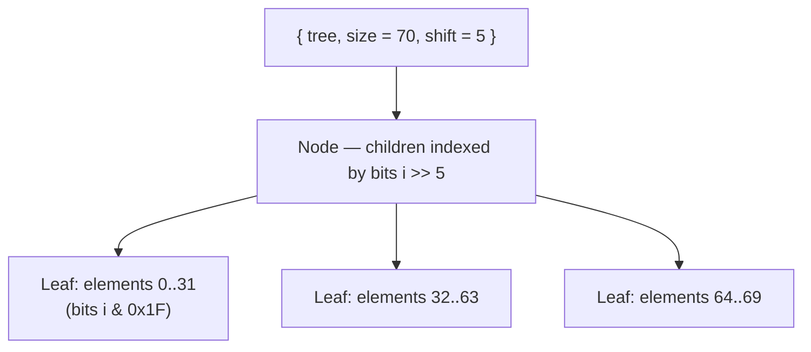

# Immutable Array

Immutable array is a persistent data structure that provides random access and update operations. Based on Clojure's [persistent vector](https://hypirion.com/musings/understanding-persistent-vector-pt-1).

## How It Works

The elements live in a 32-way tree: internal `Node`s hold up to 32 children
and `Leaf`s hold up to 32 elements. Indexing walks the tree using 5 bits of
the index per level (`(i >> shift) & 0x1F`), so random access and point
updates are O(log32 n) — effectively constant for practical sizes. For
example, 70 elements need just one internal node above three leaves:



`set` copies only the path from the root to the affected leaf (at most
log32 n nodes) and shares every other subtree with the original array, which
is why updates are cheap and old versions remain valid. Nodes produced by
`concat` may be "relaxed" — not all subtrees completely full — and carry a
per-child size table that indexing consults instead of the pure 5-bit path.

# Usage

## Create

You can create an empty array using `new()` or construct it using `of()`, or use `from_iter()` to construct it from an iterator.

```mbt check
///|
test {
  let _arr1 = @array.from_array([1, 2, 3, 4, 5])
  let _arr2 : @array.T[Int] = @array.new()
  let _arr3 = @array.from_iter((1).until(5))
  let _arr4 = @array.from_array([1, 2, 3])
}
```

Or use `make()`, `makei()` to create an array with some elements.

```mbt check
///|
test {
  let arr1 = @array.make(5, 1)
  @test.assert_eq(arr1.to_array(), [1, 1, 1, 1, 1])
  let arr2 = @array.makei(5, i => i + 1)
  @test.assert_eq(arr2.to_array(), [1, 2, 3, 4, 5])
}
```

## Update 

Since the array is immutable, the `set()`, `push()` operation is not in-place. It returns a new array with the updated value.

```mbt check
///|
test {
  let arr1 = @array.from_array([1, 2, 3, 4, 5])
  let arr2 = arr1.set(2, 10).push(6)
  @test.assert_eq(arr1.to_array(), [1, 2, 3, 4, 5])
  @test.assert_eq(arr2.to_array(), [1, 2, 10, 4, 5, 6])
}
```

## Concatenation

You can use `concat()` to concatenate two arrays.

```mbt check
///|
test {
  let arr1 = @array.from_array([1, 2, 3])
  let arr2 = @array.from_array([4, 5, 6])
  let arr3 = arr1.concat(arr2)
  @test.assert_eq(arr3.to_array(), [1, 2, 3, 4, 5, 6])
}
```

## Query

You can use `get()` to get the value at the index, or `length()` to get the length of the array, or `is_empty()` to check whether the array is empty.

```mbt check
///|
test {
  let arr = @array.from_array([1, 2, 3, 4, 5])
  @test.assert_eq(arr[2], 3)
  @test.assert_eq(arr.length(), 5)
  @test.assert_eq(arr.is_empty(), false)
}
```

## Iteration

You can use `iter()` to get an iterator of the array, or use `each()` to iterate over the array.

```mbt check
///|
test {
  let arr = @array.from_array([1, 2, 3, 4, 5])
  inspect(arr.iter(), content="[1, 2, 3, 4, 5]")
  let val = []
  arr.each(v => val.push(v))
  @test.assert_eq(val, [1, 2, 3, 4, 5])
  let vali = []
  arr.eachi((i, v) => vali.push((i, v)))
  @test.assert_eq(vali, [(0, 1), (1, 2), (2, 3), (3, 4), (4, 5)])
}
```

# TODO

- [] Add `split` and other operations that can be derived from `split` and `concat` like `insert` and `delete`.
- [] Add an algorithm description in README, since this algorithm does not use the invariant in the ICFP paper. Instead, it uses the "search step invariant" in Hypirion's thesis.
- [] Add a benchmark to compare the performance with the previous version.
- [] Optimizations such as tail.
