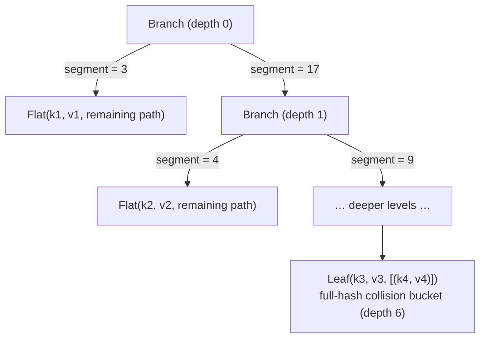
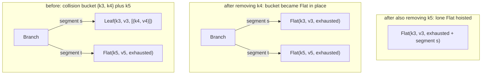

# Immutable HashMap

A persistent hash map based on hash array mapped tries (HAMT). All operations return new maps, leaving the original unchanged.

## Create

```mbt check
///|
test "create" {
  let empty : @hashmap.HashMap[String, Int] = @hashmap.new()
  inspect(empty.length(), content="0")
  let single = @hashmap.singleton("a", 1)
  debug_inspect(single.get("a"), content="Some(1)")
  let from_arr = @hashmap.HashMap([("a", 1), ("b", 2)])
  inspect(from_arr.length(), content="2")
}
```

## Add, Get, Remove

`add` returns a new map with the key-value pair added. `remove` returns a new map with the key removed.

```mbt check
///|
test "add_get_remove" {
  let map = @hashmap.new().add("a", 1).add("b", 2)
  debug_inspect(map.get("a"), content="Some(1)")
  inspect(map.contains("b"), content="true")
  inspect(map["a"], content="1")
  let map2 = map.remove("a")
  debug_inspect(map2.get("a"), content="None")
  // Original map is unchanged
  debug_inspect(map.get("a"), content="Some(1)")
}
```

## Transform and Filter

```mbt check
///|
test "transform" {
  let map = @hashmap.HashMap([("a", 1), ("b", 2), ("c", 3)])
  let doubled = map.map((_k, v) => v * 2)
  debug_inspect(doubled.get("b"), content="Some(4)")
  let filtered = map.filter((_k, v) => v > 1)
  inspect(filtered.contains("a"), content="false")
  inspect(filtered.contains("b"), content="true")
}
```

## Index Access

Use `map["key"]` (the `at` operator) for direct access. Panics if the key is not found.

```mbt check
///|
test "index_access" {
  let map = @hashmap.HashMap([("x", 10), ("y", 20)])
  @test.assert_eq(map["x"], 10)
  @test.assert_eq(map["y"], 20)
}
```

## Iteration

`each` iterates over key-value pairs. `iter` and `iter2` return iterators. `keys` and `values` return iterators over keys or values only.

```mbt check
///|
test "iteration_full" {
  let map = @hashmap.singleton("a", 1)
  // each
  let buf = []
  map.each(fn(k, v) { buf.push((k, v)) })
  debug_inspect(buf, content="[(\"a\", 1)]")
  // fold
  let sum = map.fold(init=0, fn(acc, _k, v) { acc + v })
  @test.assert_eq(sum, 1)
  // keys / values
  debug_inspect(map.keys().to_array(), content="[\"a\"]")
  debug_inspect(map.values().to_array(), content="[1]")
  // to_array
  debug_inspect(map.to_array(), content="[(\"a\", 1)]")
}
```

## Set Operations

`union` and `intersection` combine maps; `difference` removes keys. By default, `union` prefers the right map on key conflicts. Use `union_with` and `intersection_with` for custom merge logic.

```mbt check
///|
test "set_operations" {
  let m1 = @hashmap.HashMap([("a", 1), ("b", 2)])
  let m2 = @hashmap.HashMap([("b", 20), ("c", 3)])
  // Union prefers right map on conflicts
  let u = m1.union(m2)
  debug_inspect(u.get("b"), content="Some(20)")
  debug_inspect(u.get("c"), content="Some(3)")
  // union_with: custom merge function
  let u2 = m1.union_with(m2, fn(_k, v1, v2) { v1 + v2 })
  debug_inspect(u2.get("b"), content="Some(22)") // 2 + 20
  // intersection_with: custom merge
  let i = m1.intersection_with(m2, fn(_k, v1, v2) { v1 * v2 })
  debug_inspect(i.get("b"), content="Some(40)") // 2 * 20
  inspect(i.contains("a"), content="false")
  // Difference keeps keys only in left
  let d = m1.difference(m2)
  debug_inspect(d.get("a"), content="Some(1)")
  inspect(d.contains("b"), content="false")
}
```

## Equality and Hashing

`==` is **content equality**: two maps are equal exactly when they hold the
same key-value pairs, no matter which sequence of operations produced them.
`Hash` agrees with `==`, so equal maps always hash equally.

```mbt check
///|
test "equality is content equality" {
  // Insertion order never matters
  let a = @hashmap.new().add("x", 1).add("y", 2).add("z", 3)
  let b = @hashmap.new().add("z", 3).add("y", 2).add("x", 1)
  assert_true(a == b)
  // Bulk construction and incremental adds agree
  let c : @hashmap.HashMap[String, Int] = HashMap([("x", 1), ("y", 2), ("z", 3)])
  assert_true(c == a)
  // Operation history is invisible: add/remove round-trips restore equality
  assert_true(a.add("w", 9).remove("w") == a)
  // Equal maps hash equally
  let h1 = Hasher()
  h1.combine(a)
  let h2 = Hasher()
  h2.combine(b)
  assert_eq(h1.finalize(), h2.finalize())
}
```

One boundary to be aware of: **iteration order is unspecified**. `==` and
`Hash` are order-blind by design, but `iter`/`each`/`to_array`/`fold` visit
entries in an internal order that is not part of the contract — in
particular, the relative order of keys whose hashes fully collide reflects
insertion history. Two equal maps can therefore iterate differently; sort
the entries if you need a deterministic order.

## Internal Structure and Canonical Form

Everything below documents the private representation. Users cannot touch
it, but it explains *why* the equality contract above holds and what future
changes must preserve.

The map is a hash array mapped trie (HAMT): a trie over the low 30 bits of
each key's hash, consumed in six 5-bit segments (lowest segment first),
each selecting one of 32 slots per level. A `Path` value tracks the
not-yet-consumed remainder of the hash, tagged so that its length is
self-describing:

```text
Path layout (32 bits):   0b11_sssss_sssss_sssss_sssss_sssss_sssss
                           ▲                                ▲
                           head tag                         segment 1
                                                            (consumed first)
exhausted path (all six segments consumed): 0b11
```

Three node shapes make up the trie:



- `Flat(key, value, remaining-path)` — a subtree holding exactly **one**
  entry, at any depth. At maximum depth its remaining path is the bare head
  tag (*exhausted*).
- `Branch(sparse-array)` — an interior node holding at least **two**
  entries beneath it.
- `Leaf(key, value, bucket)` — a maximum-depth collision bucket holding at
  least **two** entries whose full hashes are equal.

### The canonical-form invariant

`HashMap` derives *structural* `Eq`: maps are compared shape by shape (with
pointer-equality short-circuiting on shared subtrees, which makes comparing
derived maps cheap). Structural comparison implements content equality only
because every operation maintains **one shape per content**:

1. a subtree that shrinks to a single entry is rebuilt as `Flat` — never a
   one-child `Branch`, never a one-entry `Leaf`;
2. `Leaf` appears only at maximum depth with ≥ 2 fully-colliding entries;
3. positions are fixed by the hash bits, so insertion order cannot leave a
   trace in the shape.

Shrinking operations (`remove`, `filter`, `intersection`,
`intersection_with`, `difference`) restore the invariant with two collapse
mechanisms — a bucket that drops to one entry becomes a `Flat` in place,
and a branch left with a lone `Flat` child hoists it one level up,
re-extending its path with the vacated slot index:



The invariant holds even under engineered full-hash collisions:

```mbt check
///|
/// Every key hashes to the same value: all entries share one bucket.
priv struct SameHashKey(Int) derive(Eq)

///|
impl Hash for SameHashKey with fn hash(_) {
  7
}

///|
impl Hash for SameHashKey with fn hash_combine(_, hasher) {
  hasher.combine_int(7)
}

///|
test "collisions preserve content equality" {
  let a = @hashmap.new().add(SameHashKey(1), 1).add(SameHashKey(2), 2)
  let b = @hashmap.new().add(SameHashKey(2), 2).add(SameHashKey(1), 1)
  assert_true(a == b)
  // Shrinking a bucket back to one entry restores the exact
  // singleton shape
  let shrunk = a.remove(SameHashKey(2))
  assert_true(shrunk == @hashmap.singleton(SameHashKey(1), 1))
}
```

The single representational freedom left is the *order* of entries inside a
collision bucket, which does reflect insertion history. `Eq` compares
buckets as unordered key-value sets and `Hash` combines entries
commutatively, so the freedom is invisible to both — it surfaces only
through iteration order, which is unspecified (see above).

The canonical-structure and QuickCheck property tests in this package pin
the invariant: after every operation, a map must be `==` to a fresh
construction of its content. Any change to this package must keep those
tests passing.
